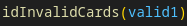
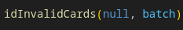
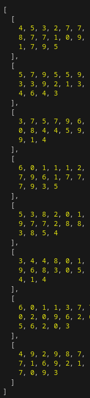
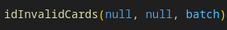

# Credit Card Checker

## Description
This JavaScript application will detect if a credit card is valid or fake.

The motivation behind this project was to challenge myself by implementing mathematics in JavaScript to verify if a credit card is legitimate or not. 

This was also a requirement through Codecademy's JavaScript course. This solution is 100% my own and no way copied anywhere else.

## Installation
1. Download and install "Node.js" if you do not have so already.

    [Download Node.js](https://www.nodejs.org/en)

2. Click on "Code<>" in the top-right corner of the screen and click: "Download as Zip" or use...

        git clone https://github.com/thoner1/Credit_Card_Checker.git
    and clone the repository to your work destination.
3. Next, open the directory/folder of "Credit_Card_Checker" in VS Code or favorite text editor application. And open **main.js** in the editor.

## How to Use
1. Once you have **main.js** opened, you have the following options:

    + **Check a single credit card number to verify if it is valid or fake**

        
        
        By entering valid1, the credit card number stored inside array: **valid1** will be run through the function to determine if it is valid.

        If you wish to enter in your own credit card number, just simply edit your number into one of the arrays and enter the name of the array into the function.

        If your credit card is valid, you will get the following response:

                Credit card is valid!
        Invalid, you will get the following response:

                Sorry, your credit card for some reason is invalid.

    + **Run through a series of credit card numbers to see which numbers are fake**

        

        Inside the function, there is a nested array named **batch** that contains a series of credit card numbers. It will run through all the credit card numbers in batch and output the invalid credit card numbers.

        Example output: 

        

    + **Run through a series of credit card numbers and correctly identify which companies correspond with the fake credit card numbers.**

        

        This will take the array **batch** and correctly identify the companies of the invalid credit card numbers.

        Example Output:

        

2. Run **node main.js** in your terminal, and the function will operate!

## Technologies

+ JavaScript
+ Node.js